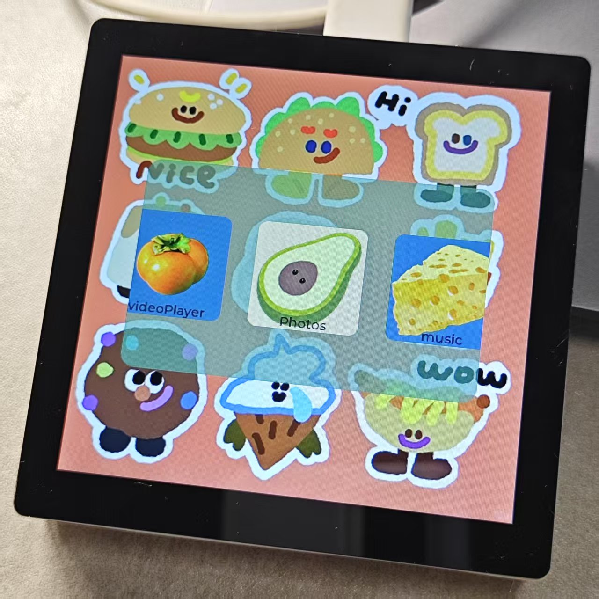

# LVGL media player for Allwinner T113S3

# eMP_mainPage



## 环境

```shell
# 请自行修改 build_easyMediaPlayer 文件的 STAGING_DIR 环境变量
export STAGING_DIR=/home/hugokkl/tina-sdk/out/t113-pi/staging_dir/target
```

## 编译

```shell
./build.sh
```

## 运行

可执行文件为：`eMP_mainPage`

## 文件

`./configs/sysconfig.json`


