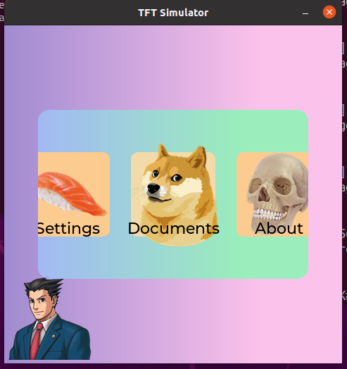

# LVGL media player for Allwinner T113S3

# eMP_mainPage

## Snapshots




## 环境

```shell
# 请自行修改 build_easyMediaPlayer 文件的 STAGING_DIR 环境变量
export STAGING_DIR=/home/hugokkl/tina-sdk/out/t113-pi/staging_dir/target
```

## 编译

- Makefile
```shell
# 交叉编译
./build.sh

# 本地编译
./build.sh 0
```

- CMake
```shell
# 交叉编译
# 设置环境变量（交叉编译需要
export STAGING_DIR=/home/hugokkl/tina-sdk/out/t113-pi/staging_dir/target

mkdir build && cd build

cmake -DCMAKE_TOOLCHAIN_FILE=cmake/build_for_t113s3.cmake ..

make -j32

# 本地编译
mkdir build && cd build

cmake ..

make -j32
```

## 运行

可执行文件为：`eMP_mainPage`

> **注意：本地编译，这需要一些文件依赖和库依赖才可以编译/运行起来...**

### 本地编译的库依赖
```bash
sudo apt update

# 包含 gcc、g++、make 等基础工具
sudo apt install build-essential  

# SDL2库、Freetype
sudo apt install libsdl2-dev libfreetype6-dev libncurses5-dev libstdc++6 

# Plus: 如果cmake时遇到Wayland依赖找不到的情况时，请输入以下指令安装
sudo apt install -y wayland-protocols libxkbcommon-dev
```

### 本地编译的文件依赖

```bash
# 请创建对应文件夹
sudo mkdir /mnt/UDISK
```

并将[此处的内容](https://github.com/ZhangKeLiang0627/EasyMediaPlayer/tree/main/firmware)全部移入该文件夹中即可！

## 文件

`./config/sysconfig.json`：该文件存储了系统的各种自定义变量，如亮度、音量等，还是其他APP应用的接口设置的地方。


